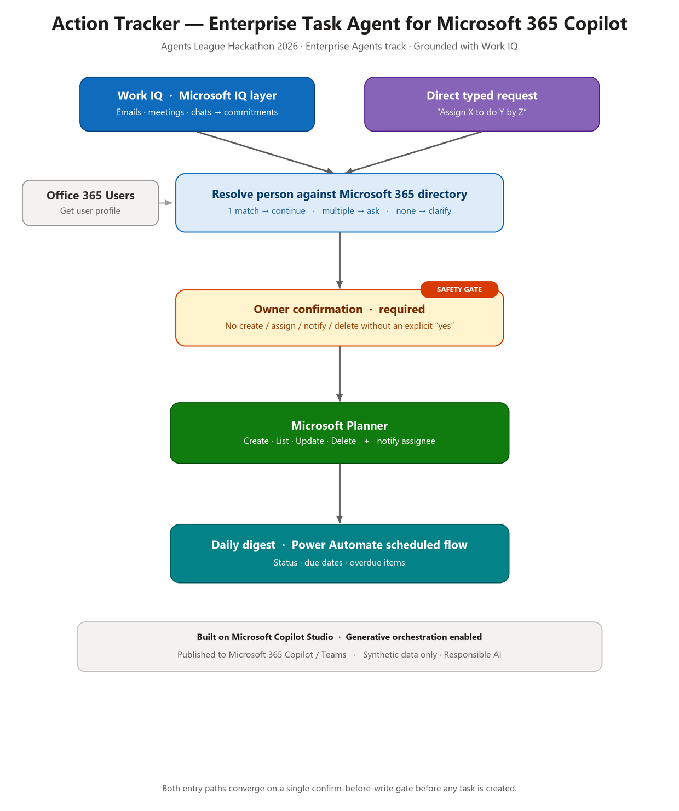

# Action Tracker — Enterprise Task Agent for Microsoft 365 Copilot

**Agents League Hackathon 2026 — Enterprise Agents track**
Built with Microsoft Copilot Studio · Grounded with **Work IQ**

**▶ Demo video:** https://vimeo.com/1201315651?share=copy&fl=sv&fe=ci

---

## What it does

Action Tracker is a Microsoft 365 Copilot agent that transforms work commitments into monitored Microsoft Planner tasks. The system addresses a pervasive organizational challenge: *decisions and commitments made in meetings and emails get forgotten and never followed through.*

The agent provides dual pathways for task creation, both flowing through a shared confirmation gate:

1. **From real work context (Work IQ):** the agent analyzes the user's emails, meetings, and chats via Work IQ, identifies commitments and follow-ups, and proposes them as tasks.
2. **From direct request:** the user provides plain-language instructions (e.g. "Assign Manish to finish the Q3 report by Friday").

The agent then validates the person against the directory, requires owner **confirmation before any creation or notification**, establishes the task in Planner with the appropriate assignee and due date, and Planner alerts the assignee. Owners can additionally list tasks, update them, delete them, and obtain an automated **daily digest** of task status and overdue items.

## Business impact

- **Problem:** Commitments made in meetings, chats, and email routinely slip — there is no reliable, low-friction bridge from "what we agreed" to "a tracked, owned task."
- **Value:** Action Tracker closes that gap directly inside Microsoft 365 Copilot, turning natural conversation and real work context into accountable Planner tasks with owners, due dates, and proactive overdue alerts — reducing dropped follow-ups and manual task entry across teams.
- **Production-ready posture:** confirm-before-write on every action, directory-validated assignees, no fabricated data, and a scheduled digest for ongoing accountability — built to operate against real tenant data, demonstrated here with synthetic data.

## Why this is an Enterprise Agent

- **Real business scenario:** task accountability spanning teams — relevant across organizations.
- **Microsoft 365 integration:** developed natively on Microsoft 365 Copilot via Copilot Studio, leveraging Microsoft Planner and the Microsoft 365 user directory.
- **Microsoft IQ layer (required):** employs **Work IQ** as the grounding mechanism — extracting context from user emails, meetings, chats, and documents — enabling authentic commitment identification rather than inference.
- **Security & Responsible AI:** the agent **never writes, assigns, or sends anything without explicit owner confirmation**. It avoids guessing people, IDs, or task data — using only directory or tool-returned values. Person ambiguity is resolved through inquiry, never assumption.

## Architecture

Both entry paths (Work IQ context and a direct typed request) converge on a single **confirm-before-write safety gate** before any task is created, updated, deleted, or notified.

## Components & tools

- **Platform:** Microsoft Copilot Studio (generative orchestration enabled)
- **IQ layer:** Work IQ (emails, meetings, chats, people, relationships)
- **Task store:** Microsoft Planner (Create, List, Update, Delete tasks)
- **Identity:** Microsoft 365 directory + Office 365 Users (Get user profile) for assignee resolution
- **Automation:** Power Automate scheduled flow for the daily digest
- **Channel:** published to Microsoft 365 Copilot / Teams

## Key features

- Two-way task creation (Work IQ context + direct request)
- Robust person resolution (single / multiple / no match handled correctly)
- Confirm-before-write on every create, update, and delete
- Full task lifecycle: create, list/status, update (priority, due date, status), delete
- Assignee notification via Planner
- Automated daily task digest

## Screenshots

Proof of the agent working (full-size images in [`/screenshots`](screenshots)):

| Step | Screenshot |
|------|------------|
| Work IQ surfaces commitments from real work context | [`01-workiq-commitments.png`](screenshots/01-workiq-commitments.png) |
| Owner confirmation (safety gate) before any write | [`02-confirmation.png`](screenshots/02-confirmation.png) |
| Same-name disambiguation / person resolution | [`03-disambiguation.png`](screenshots/03-disambiguation.png) |
| Task created and assigned in Microsoft Planner | [`04-planner-assigned.png`](screenshots/04-planner-assigned.png) |
| Status / daily digest with overdue highlighting | [`05-status-digest.png`](screenshots/05-status-digest.png) |

## Repository contents

| Path | What it is |
|------|------------|
| `README.md` | This file — project overview |
| `instructions.md` | The agent's full instruction set (its reasoning logic) |
| [`/screenshots`](screenshots) | Proof screenshots + the architecture diagram (`architecture.png`) |
| `agent-solution.zip` | Exported Copilot Studio agent solution (for reproducibility) |
| `PowerAutomate-Flow-trigger.zip` | Exported Power Automate daily-digest flow |

## Demo

Demo video: **https://vimeo.com/1201315651?share=copy&fl=sv&fe=ci**

Example flow shown in the demo:
1. Agent surfaces a commitment from a real email via Work IQ and proposes a task.
2. Owner confirms → task is created in Planner and the assignee is notified.
3. Owner types a new task directly; the agent resolves the person and confirms.
4. Owner asks for status → agent lists tasks and highlights overdue ones.

## How to run / reproduce

1. In Microsoft Copilot Studio, import the agent solution `agent-solution.zip` (or create a new agent and enable **generative orchestration**).
2. Enable **Work IQ** in the agent's Tools.
3. Add the Planner actions (Create, List, Update, Delete a task) and Office 365 Users (Get user profile).
4. Apply the agent instructions from `instructions.md`.
5. Publish to Microsoft 365 Copilot / Teams.
6. (Optional) Import the Power Automate daily-digest flow `PowerAutomate-Flow-trigger.zip`.

## Responsible AI & security

- No action that creates, assigns, sends, or deletes is taken without explicit user confirmation.
- The agent does not fabricate people, emails, IDs, or task data — only tool/directory values are used.
- No secrets, credentials, API keys, or connection strings are stored in this repository.
- **All data used in this project is synthetic / demonstration data. No real customer data or PII is used.**

## Team

| Name | Role | Microsoft Learn username |
|------|------|--------------------------|
| Manish Soni | Solo participant — design, build, and submission | Manish Soni |

> Solo submission.

---

*Built for the Agents League Hackathon 2026, Enterprise Agents track. Uses synthetic data only.*
